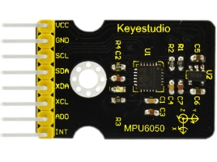

# KS0170 keyestudio MPU6050 Gyroscope and Accelerometer module

## 1. Introduction

The MPU-6050 is the world’s first integrated 9-axis Motion Tracking device that combines a 3-axis MEMS gyroscope, 3-axis MEMS accelerometer, and a Digital Motion Processor (DMP).

With its dedicated I2C sensor bus, it directly accepts inputs from an external 3-axis compass to provide a complete 9-aixs output.

The MPU-6050 is also designed to interface with multiple non-inertial digital sensors, such as pressure sensors.

The MPU-6050 features three 16-bit analog-to-digital converters (ADCs) for digitizing the gyroscope outputs and three 16-bit ADCs for digitizing the accelerometer outputs.

For precision tracking of both fast and slow motions, the parts feature a user-programmable gyroscope full-scale range of±250, ±500, ±1000, and ±2000°/sec (dps) and a user-programmable acceleration full-scale range of  ±2g, ±4g, ±8g, and ±16g.

## 2. Specification

- Chip: MPU-6050
- Power supply: 3-5V(Internal low offset voltage )
- Communication method: standard IIC protocol
- Built in 16-bit analog-to-digital converter, 16-bit data output
- Gyroscope range: ±250 500 1000 2000°/sec
- Accelerometer range: ±2±4±8±16g
- Pin pitch: 2.54mm